# 🌀 iBiz App Hub

基于 **iBiz 平台** 产出的模型 + **Vue 全家桶**（Vue3、Vite、Element Plus、TSX）构建的企业级中后台前端解决方案。

> 📚 [官方文档与说明 https://open.ibizlab.cn/apphub/ ](https://open.ibizlab.cn/apphub/)


## ✨ 特性

- 🐒 **开箱即用**  
  企业级中后台前端套件，预置权限管理 / 路由配置 / 多语言等模块，生产可用。
- 🐯 **跨应用协同**  
  模型数据驱动的微前端集成，各团队可独立演进，框架层统一编排与视图整合。
- 🦁 **模型驱动开发**  
  支持 DSL 配置到 UI 组件的自动映射，快速开发与灵活定制。
- 🐌 **多场景融合**  
  菜单、数据关系部件、树部件、界面行为组等功能一体化。
- 🐂 **热插拔插件生态**  
  支持运行时动态加载/卸载插件，快速适配复杂业务。


## 🤔 适用场景

如果你的项目需要：

- 🚀 快速交付企业级前端应用
- 🔄 快速应对复杂多变的业务需求
- 🛠️ 构建高可维护的前端资产
- 🌐 多应用整合并降低架构治理成本
- 📊 覆盖垂直业务场景（AI 交互 / 数据可视化 / 工作流引擎 / 表单设计 / 逻辑设计等）

那么 **iBiz App Hub** 会是你的高效选择。


## 🛠 技术栈

### 核心框架
- **Vue 3** — 组件化 + 响应式数据绑定
- **Vue Router 4** — 动态路由 & 嵌套路由
- **Pinia** — 轻量状态管理，支持 TS 与 Composition API

### UI 框架
- **Element Plus** — Web 端组件库
- **Vant** — 移动端组件库

### 数据请求
- **Axios** — 拦截器 / 请求取消 / 全局配置

### 样式
- **Sass** — CSS 预处理器

### 国际化
- **Vue I18n** — 多语言支持

### 工具链
- **Vite** — 极速开发构建
- **pnpm** — 高效包管理，支持 Monorepo
- **ESLint** + **Prettier** — 代码规范与格式化

### 测试工具
- **Vitest** — 单元测试与组件测试


## 🚀 快速开始

```bash
$ git clone https://github.com/ibizlab-cloud/ibiz-app-hub
```

### 构建底包

```bash
$ cd ibiz-app-hub && pnpm i
$ npm run build
```

### 运行web端runner

```bash
# 1. run web app
$ npm run web:dev
# 2. preview web app
$ npm run web:preview
```

### 运行移动端runner

```bash
# 1. run mob app
$ npm run mob:dev
# 2. preview mob app
$ npm run mob:preview
```

### 运行示例项目

```bash
# 1. run demo app
$ npm run demo:dev
# 2. preview demo app
$ npm run demo:preview
```


## 🔄 iBiz自研库

| 库名称                            | 功能描述                                                                                                                                         |
| --------------------------------- | ------------------------------------------------------------------------------------------------------------------------------------------------ |
| `@ibiz/model-core`                | 前端应用层模型对象接口规范，[查看详细说明](./models/model-core)                          |
| `@ibiz/rt-model-api`              | iBiz前端运行时模型编译库，[查看详细说明](./models/rt-model-api)                          |
| `@ibiz-template/core`             | 运行时核心库，[查看详细说明](./packages/core)                                      |
| `@ibiz-template/model-helper`     | 模型处理工具库，[查看详细说明](./packages/model-helper)                              |
| `@ibiz-template/runtime`          | 运行时逻辑库，[查看详细说明](./packages/runtime)                                   |
| `@ibiz-template/theme`            | 样式功能库，[查看详细说明](./packages/theme)                                         |
| `@ibiz-template/vue3-util`        | 通用组件库(vue3)，[查看详细说明](./packages/vue3-util)                             |
| `@ibiz-template/web-theme`        | web端主题样式，[查看详细说明](./components/web-theme)                               |
| `@ibiz-template/vue3-components`  | web端组件库，[查看详细说明](./components/ibiz-next-vue3)                               |
| `@ibiz-template/mob-theme`        | 移动端主题样式，[查看详细说明](./components/mob-theme)                               |
| `@ibiz-template/mob-vue3-components`  | 移动端组件库，[查看详细说明](./components/ibiz-next-mob-vue3)                               |
| `@ibiz-template-plugin/gantt`   | iBiz甘特图插件，[查看详细说明](./plugins/ibiz-gantt)                                |
| `@ibiz-template-plugin/ai-chat`   | iBizAI交互框插件，[查看详细说明](./plugins/ibiz-ai-chat)                                |
| `@ibiz-template-plugin/bi-report` | iBiz智能报表，[查看详细说明](./plugins/ibiz-bi-report)                                  |
| `@ibiz-template-plugin/data-view` | iBiz数据大屏，[查看详细说明](./plugins/ibiz-data-view)                                  |
| `@ibiz-template/devtool`          | IBiz系统可视化调试套件，[查看详细说明](./plugins/ibiz-template-devtools)                 |


## 🌱 案例展示
### 📈 iBizPLM：产品全生命周期管理系统
覆盖从需求、设计、开发、测试到交付全过程，对标 PingCode、ONES 的精品开源 PLM 解决方案。 🚀 [https://plm.ibizlab.cn](https://plm.ibizlab.cn)
 

### 👥 iBizCRM：客户关系管理系统
借鉴了zoho的优秀理念，提供强大又灵活的客户关系管理能力。支持本地部署，数据安全可控。 🚀 [https://crm.ibizlab.cn](https://crm.ibizlab.cn)
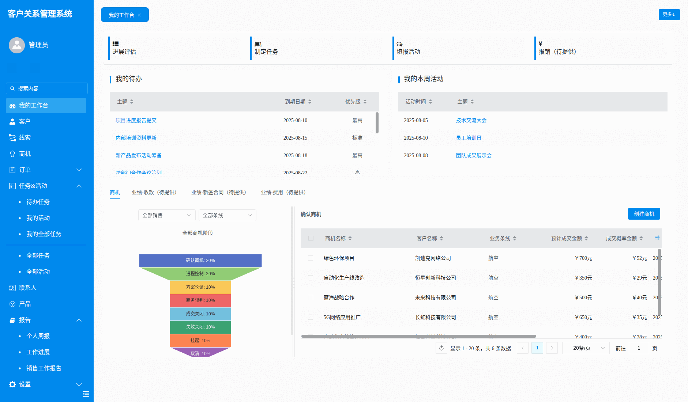

### 🛠 iBizModeling：一体化模型驱动建模开发平台
DSL驱动、数据建模、界面建模、流程建模、插件发布，安全可控，可用来打造自己的低代码平台。 🚀 [https://modeling.ibizlab.cn](https://modeling.ibizlab.cn)
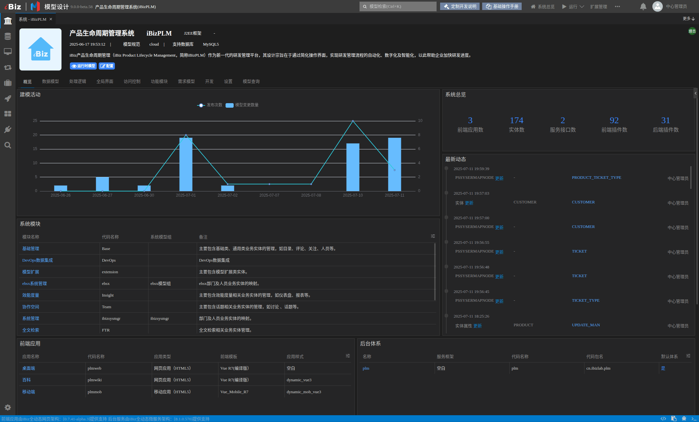

>  ***更多精品案例请关注[iBizLab开源实验室](https://www.ibizlab.cn)最新发布***


## 🌐 跨应用协同架构
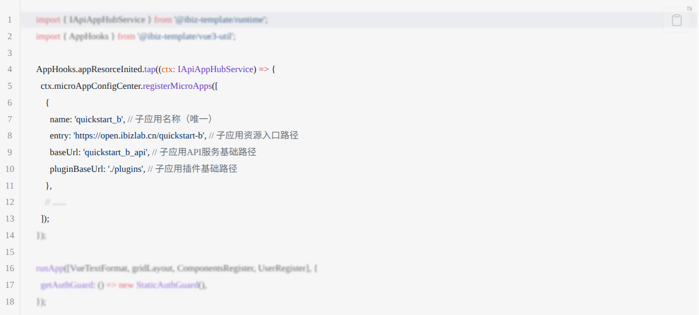

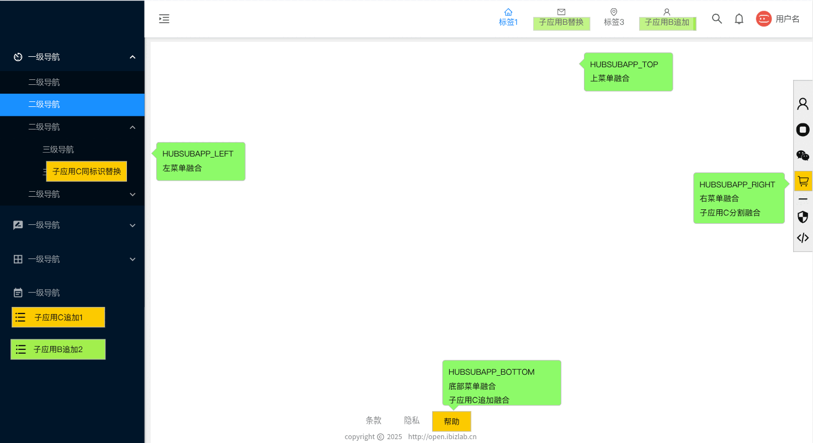


## 🛠️ 组件库
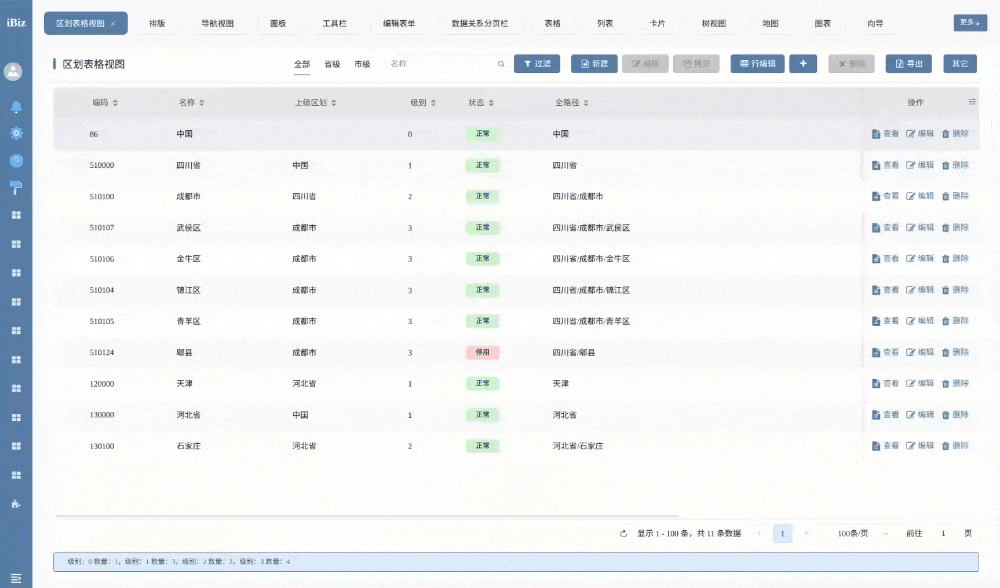

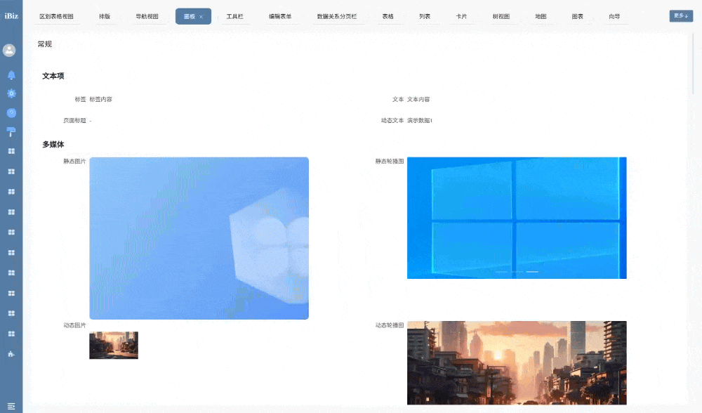

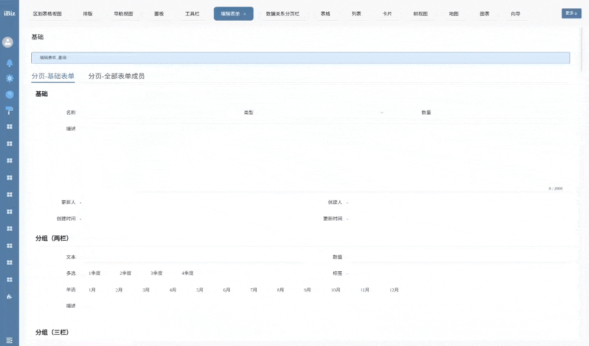


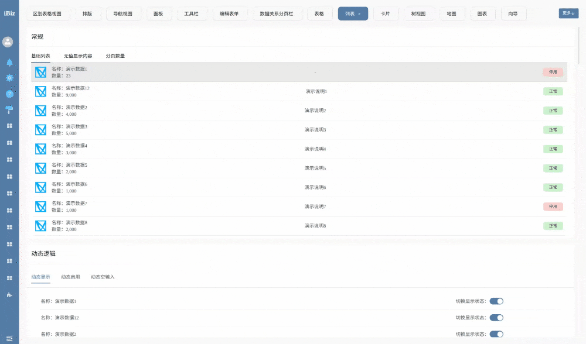


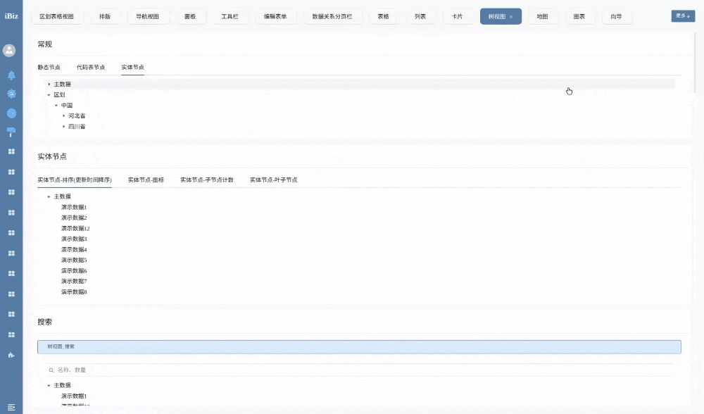


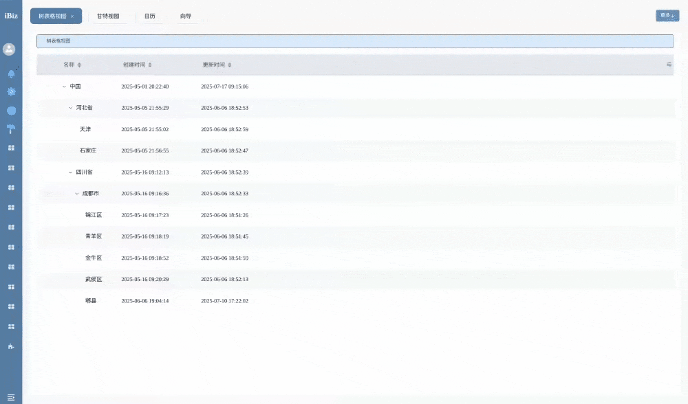

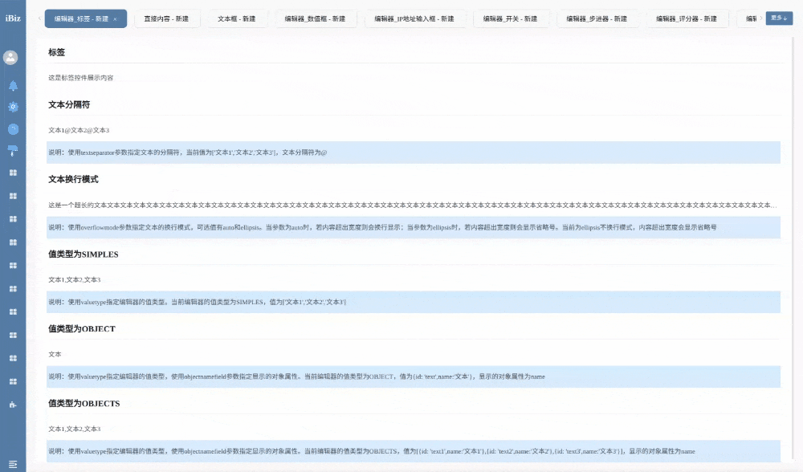


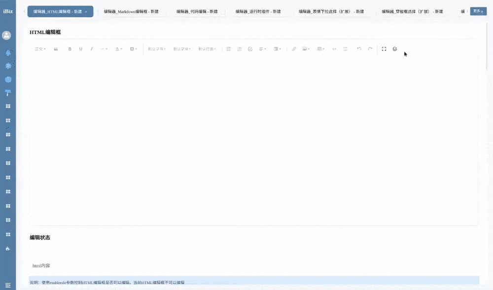


## ❤️ 社区

- 🌐 开源实验室官网：https://www.ibizlab.cn
- 💬 开源社区：https://open.ibizlab.cn
- 💬 Modeling建模工具：https://modeling.ibizlab.cn
- 📱 微信公众号：iBiz开放平台
- 💬 QQ交流群：1067434627


## 💬 LICENSE

采用 **MIT License** 许可证。详情请参阅项目根目录下的 [LICENSE](LICENSE) 文件。
