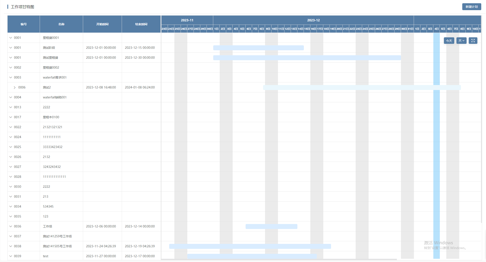

# 甘特图

甘特图基础组件，主要是在XGantt组件上进行功能扩展

## 页面展示


## 新增输入
| 名称     | 说明                                                         |
| -------- | ------------------------------------------------------------ |
| children | 指定数据的子集属性，默认为【children】 |
| leaf | 指定数据的叶子节点属性，默认为【leaf】 |
| allowDrag | 判断节点能否被拖拽 如果返回 false ，节点不能被拖动 Function(node) |
| allowDrop | 拖拽时判定目标节点能否成为拖动目标位置。 如果返回 false ，拖动节点不能被拖放到目标节点。 type 参数有三种情况：'prev'、'inner' 和 'next'，分别表示放置在目标节点前、插入至目标节点和放置在目标节点后 Function(draggingNode, dropNode, type) |
| showViewToolbar | 是否显示视图工具栏，默认为【true】 |
| dateRange | 指定甘特图头显示的时间范围 |
| show-weekdays | 根据数组内周天数显示列 ( [0, 1, 2, 3, 4, 5, 6] 其中0代表周日，1代表周一，依此类推 ) |
| expand-key | 指定数据的节点展开属性，默认为空字符串 |
| preload    | 虚拟表格绘制预加载条数 |
| enableDateCompletion | 启用时间自动补全。启用后，按照当前的时间单位，开始时间设置为时间的开始，结束时间设置为时间的结束。示例：时间单位为'day'，开始时间（2025-05-13 12:12:12）、结束时间（2025-05-13 12:12:12），开启后，开始时间（2025-05-13 00:00:00）、结束时间（2025-05-13 23:59:59） |

**dateRange数据格式**
```json
{
  start: string | Date;
  end: string | Date;
}
```
**show-weekdays数据格式**
```json
[0, 1, 2, 3, 4, 5, 6]
```
## 新增输出
| 名称     | 说明                                                         |
| -------- | ------------------------------------------------------------ |
| node-drop | 拖拽成功完成时触发的事件，共三个参数，依次为：被拖拽节点对应的 Node、结束拖拽时最后进入的节点、被拖拽节点的放置位置（before、after、inner） |

## 插槽
| 插槽名     | 说明                                        | 类型                                    |
| --------- | ------------------------------------------- | --------------------------------------- |
| ganttCell | 自定义甘特图单元格内容                        | { row: any, column: any }               |
| empty     | 当数据为空时自定义的内容                      | —                                       |
| ganttTitle| 自定义甘特图头部内容                          | { row: any, column: any }               |

## 滑块新增输入
| 名称     | 说明                                                         |
| -------- | ------------------------------------------------------------ |
| resizeMode | 调整大小模式，'unilateral': 单边调整模式，可通过resize增加左边或右边宽度，负值时移动滑块。'dragonly': 仅拖动模式，只能整体拖动来移动滑块，resize仍为单边调整 |

## 扩展功能

1. 甘特视图区提供工具操作栏组件ViewToolbar（跳转至今日，甘特视图切换，全屏功能）

2. 提供empty插槽，在无数据时会在右侧表格区绘制empty插槽内容

3. 原拖拽功能为交换，现改为拖拽（在AllData中新增draggable方法，原交换方法的BUG已修改）

## 拖拽逻辑

draggable为true时启用拖拽：

1. 默认情况下，仅允许拖拽同父内容的顺序。如果需要任意层级的拖拽时，可以传递一个对象，将参数配置为：{ level: 'all' } 即可

2. 拖拽时可拖入目标之前，里面，之后；具体判断是根据鼠标悬浮的位置判断：前（0 - 0.2），中（0.2-0.8），后（0.8-0）。在同级父拖拽时，不能拖入项里面

3. 拖拽实际上改变甘特图中维护的原始数据集合【originData】，当原始数据发生改变时，会重新计算界面数据【data】和【flatData】，从而改变界面绘制

4. 拖拽时可通过【allowDrag】和【allowDrop】控制哪些节点可拖放

## 参考

项目：[GANTT](https://github.com/xpyjs/gantt)

文档：[XGantt](https://xpyjs.github.io/gantt/docs/)
